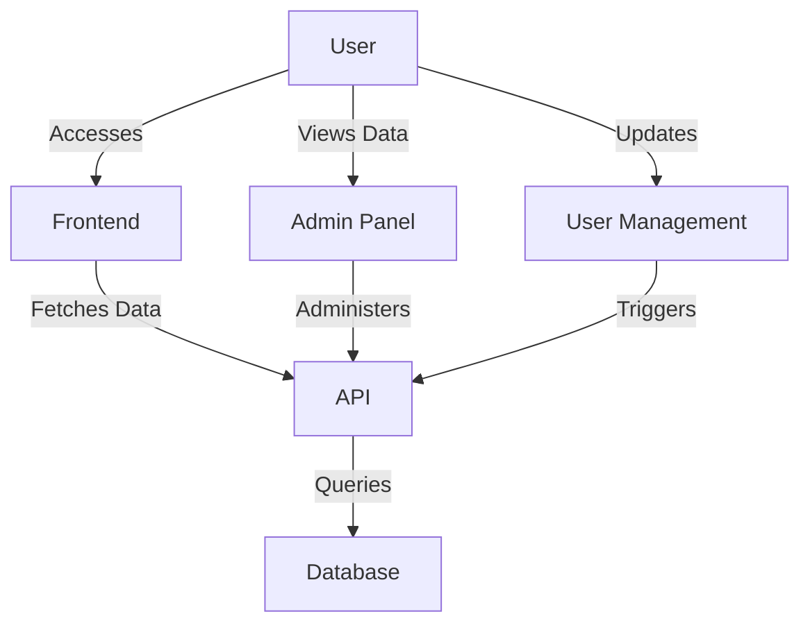

# Architecture Overview
This architecture overview outlines the components and flow of the application. The interaction between users, the frontend, API, database, and admin panel is visualized in the diagram above.